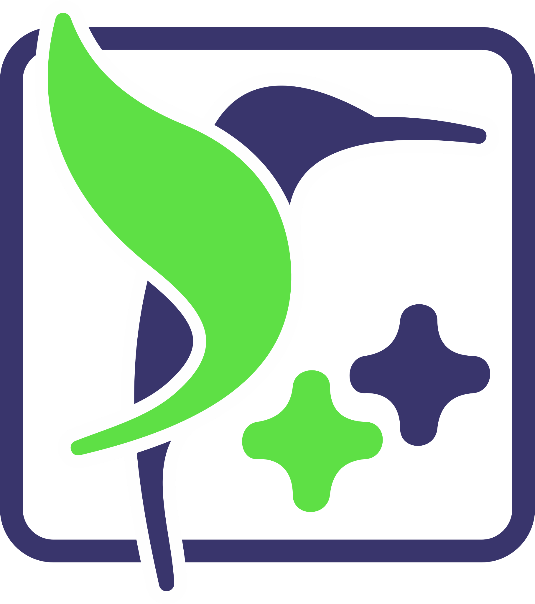

# Contributing

## Bug reports

Found a bug? Let's make it disappear forever.

To file a bug report, use the `Bug Report` issue template, which requires the following information:

- A detailed description of what the bug is, including what you observed,
  and what you _expected_. The expected output may seem obvious, but what
  _you_ think should happen might be different from what _we_ think
  should happen.

- A minimal reproducible example (MRE) to help us verify the bug.
  This should include all relevant source code, compilation commands,
  and output from executing the code where relevant.

- Information about your setup including:
  - What version of `doctest` you're using
  - What operating system / architecture you're using
  - What compiler you're using

- Any extra information that you think could be useful

## Feature proposals

Do you have an idea on how to make an improvement to the project?
Awesome! There are many ways to improve it, such as writing documentation, adding tests,
or proposing new library features. However, keep the following things in mind:

- Please read through the [design goals](doc/markdown/features.md) before proposing a feature.

- Check out the `dev` branch to ensure the feature has not been implemented already.

- Any **additions** to the library needs to be clearly motivated. Submitting the proposal with
  a motivation of "it would be nice to have" is not sufficient. Please provide a clear example
  with code showing real usage of the feature (not just a dummy example), and explain how it is useful.

- Any **change** in API is likely to break some users setup, so this should be considered
  very carefully. If accepted, it will be slated for inclusion in a future 3.x release.

To submit a feature request, use the `Feature Request` issue template, which requires the following information:

- A detailed description of what your feature is. Preferably, this would include
  code examples demonstrating this hypothetical feature, and possible outputs
  that we might expect it to produce. You should also provide some explanation
  as to _why_ this change would be useful.

- An explanation as to whether you can already achieve this proposed behaviour
  with the API provided by the library **as it currently is**. Notably, we want
  to know whether this is a completely new behaviour being requested, or whether
  you just want something to be made a little simpler, faster, or accessible.

- Any extra information that you think could be useful

## Pull requests

Pull requests are welcome. Preferably, your pull request will be associated with some issue
that has already been discussed and slated for inclusion in the next release.
Non-code changes, such as improvements to our documentation, additional unit-tests,
changes to our CI configuration, etc, do not necessitate a source issue.

Pull requests should be made against the `dev` branch. Backporting of changes
will be dealt with by maintainers.

The `doctest/doctest.h` header is automatically generated from source files found in `doctest/parts/*`.
It can be generated by running the `scripts/assemble.py` script.

Preferably, your change will also come with additional examples (found in `examples/`)
and unit-tests (found in `tests/`). For bug fixes in particular, consider introducing
a regression test (found in `tests/regression`) which specifically targets the reported bug.

Our `examples/` use the "golden file" strategy for testing, in which the literal output
of the example is compared against a reference file. If you change the behaviour
of the library, these files might need to change also. If you are using CMake,
you can use `DOCTEST_TEST_MODE=COLLECT` to automatically update these files
when the examples are run.

## AI policy

Please refer to the project [AI_POLICY.md](AI_POLICY.md) for information regarding AI usage.

---------------

[Home](readme.md#reference)

