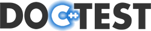
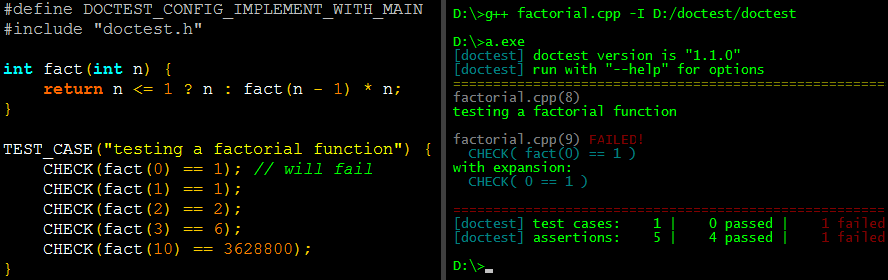

<!--

-->

<h3>The fastest C++98/C++11 single-header testing framework for unit tests and TDD</h3>

<!--
<a href="https://travis-ci.org/onqtam/doctest"></a>
<a href="https://ci.appveyor.com/project/onqtam/doctest/branch/master"></a>
<a href="https://coveralls.io/github/onqtam/doctest?branch=master"></a>
<a href="https://scan.coverity.com/projects/onqtam-doctest"></a>

<a href="https://travis-ci.org/onqtam/doctest"></a>
<a href="https://ci.appveyor.com/project/onqtam/doctest/branch/dev"></a>
<a href="https://coveralls.io/github/onqtam/doctest?branch=dev"></a>

-----------


-->
<b>
<table>
    <tr>
        <td>
            master branch
        </td>
        <td>
            Linux/OSX <a href="https://travis-ci.org/onqtam/doctest"></a>
        </td>
        <td>
            Windows <a href="https://ci.appveyor.com/project/onqtam/doctest/branch/master"></a>
        </td>
        <td>
            <a href="https://coveralls.io/github/onqtam/doctest?branch=master"></a>
        </td>
        <td>
            <a href="https://scan.coverity.com/projects/onqtam-doctest"></a>
        </td>
    </tr>
    <tr>
        <td>
            dev branch
        </td>
        <td>
            Linux/OSX <a href="https://travis-ci.org/onqtam/doctest"></a>
        </td>
        <td>
            Windows <a href="https://ci.appveyor.com/project/onqtam/doctest/branch/dev"></a>
        </td>
        <td>
            <a href="https://coveralls.io/github/onqtam/doctest?branch=dev"></a>
        </td>
        <td>
        </td>
    </tr>
</table>
</b>

[](http://www.patreon.com/onqtam)

This library is free, and will stay free but needs your support to sustain its development. There are lots of <a href="doc/markdown/roadmap.md"><b>new features</b></a> and maintenance to do. If you work for a company using **doctest** or have the means to do so, please consider financial support. Monthly donations via Patreon and one-offs via PayPal.

[](https://www.paypal.me/onqtam)

A complete example with a self-registering test that compiles to an executable looks like this:



**doctest** is a new C++ testing framework but is by far the fastest both in compile times (by [**orders of magnitude**](doc/markdown/benchmarks.md)) and runtime compared to other feature-rich alternatives. It brings the ability of compiled languages such as [**D**](https://dlang.org/spec/unittest.html) / [**Rust**](https://doc.rust-lang.org/book/testing.html) / [**Nim**](https://nim-lang.org/docs/unittest.html) to have tests written directly in the production code by providing a fast, transparent and flexible test runner with a clean interface.

*Tests can be considered a form of documentation and should be able to reside near the production code which they test.*

**doctest** is modeled after [**Catch**](https://github.com/philsquared/Catch) which is currently the most popular alternative for testing in C++ - check out [**the differences**](doc/markdown/faq.md#how-is-doctest-different-from-catch).

You can read more about it in [**the article**](https://accu.org/var/uploads/journals/Overload137.pdf) of the february edition of ACCU Overload 2017.

[](https://en.wikipedia.org/wiki/C%2B%2B#Standardization)
[](https://opensource.org/licenses/MIT)
[](https://github.com/onqtam/doctest/releases)
[](https://raw.githubusercontent.com/onqtam/doctest/master/doctest/doctest.h)
[](https://bestpractices.coreinfrastructure.org/projects/503)
[](https://gitter.im/onqtam/doctest?utm_source=badge&utm_medium=badge&utm_campaign=pr-badge&utm_content=badge)
[](https://wandbox.org/permlink/SJrRfwy3aaLwjndl)
<!--
[](https://isocpp.org/)
[](https://github.com/onqtam/doctest/blob/master/doc/markdown/readme.md#reference)
-->

Documentation
-------------

Project:

- [Features and design goals](doc/markdown/features.md) - the complete list of features and rationale behind the design
- [Roadmap](doc/markdown/roadmap.md) - upcoming features
- [Benchmarks](doc/markdown/benchmarks.md) - compile-time and runtime supremacy
- [Contributing](CONTRIBUTING.md) - how to make a proper pull request
- [Changelog](CHANGELOG.md) - generated changelog based on closed issues/PRs

Usage:

- [Tutorial](doc/markdown/tutorial.md) - make sure you have read it before the other parts of the documentation
- [Assertion macros](doc/markdown/assertions.md)
- [Test cases, subcases and test fixtures](doc/markdown/testcases.md)
- [Parameterized test cases](doc/markdown/parameterized-tests.md)
- [Command line](doc/markdown/commandline.md)
- [Logging macros](doc/markdown/logging.md)
- [```main()``` entry point](doc/markdown/main.md)
- [Configuration](doc/markdown/configuration.md)
- [String conversions](doc/markdown/stringification.md)
- [FAQ](doc/markdown/faq.md)
- [Build systems](doc/markdown/build-systems.md)
- [Examples](examples)

Contributing
------------

[](http://www.patreon.com/onqtam)

Support the development of the project with donations! There is a list of planned features which are all important and big - see the [**roadmap**](doc/markdown/roadmap.md). I took a break from working in the industry to make open source software so every cent is a big deal.

[](https://www.paypal.me/onqtam)

If you work for a company using **doctest** or have the means to do so, please consider financial support.

Contributions in the form of issues and pull requests are welcome as well - check out the [**Contributing**](CONTRIBUTING.md) page.


Sponsors
--------

Want to see your name or the name of your company here? Consider donating!

### :zap: Rockstar sponsors :zap:

### :gem: Gold sponsors :gem:

- Pascal Thomet
- Mario Kostadinov

### :cake: Silver sponsors :cake:

- Dan Nissenbaum

### :hamburger: Bronze sponsors :hamburger:

- Sebastien Feldis
- Zahari Karadzhov
