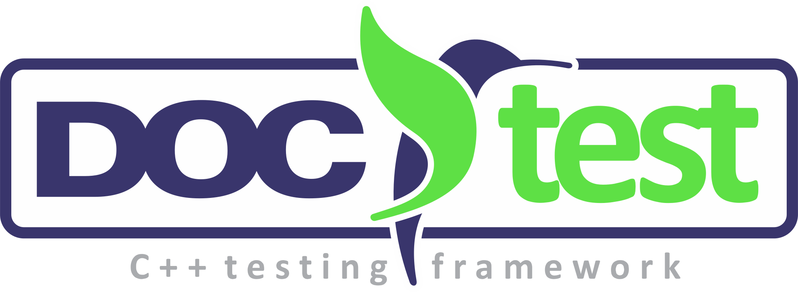
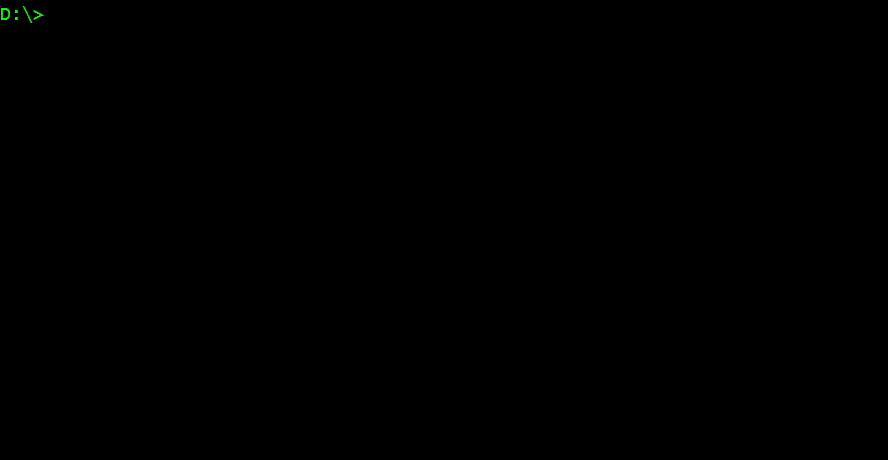
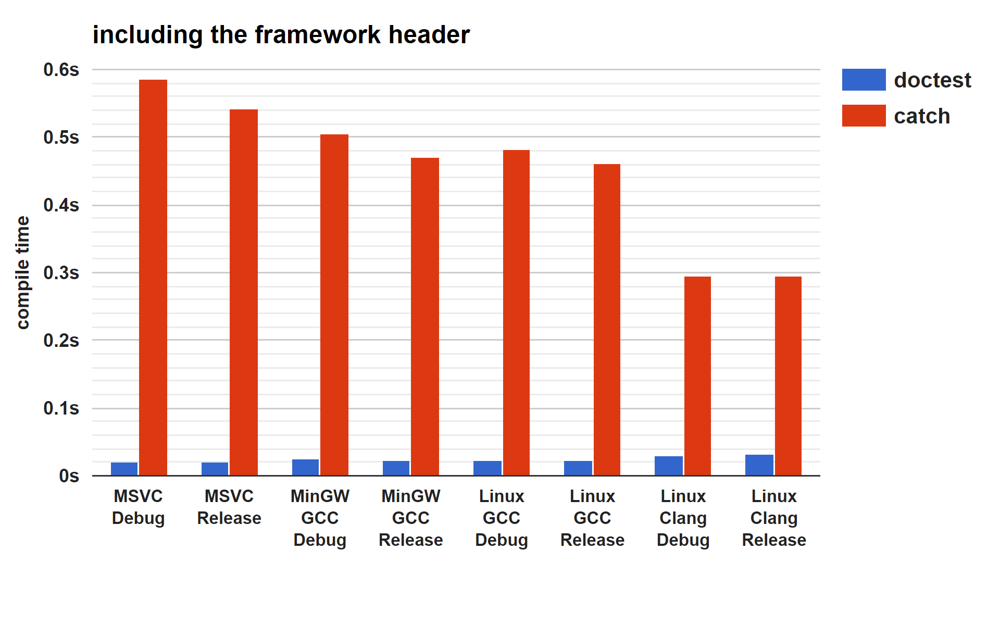
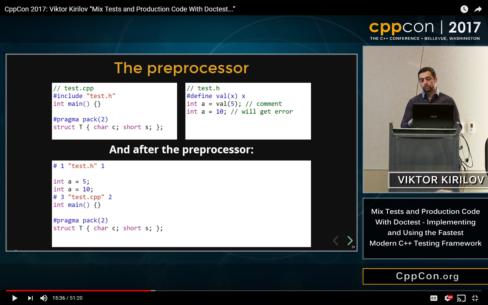

<p align="center"></p>

<b>
<table>
    <tr>
        <td>
            master branch
        </td>
        <td>
            <a href="https://github.com/doctest/doctest/actions?query=branch%3Amaster"></a>
        </td>
        <td>
            <a href="https://coveralls.io/github/onqtam/doctest?branch=master"></a>
        </td>
    </tr>
    <tr>
        <td>
            dev branch
        </td>
        <td>
            <a href="https://github.com/doctest/doctest/actions?query=branch%3Adev"></a>
        </td>
        <td>
            <a href="https://coveralls.io/github/onqtam/doctest?branch=dev"></a>
        </td>
    </tr>
</table>
</b>

**doctest** is a new C++ testing framework but is by far the fastest both in compile times (by [**orders of magnitude**](doc/markdown/benchmarks.md)) and runtime compared to other feature-rich alternatives. It brings the ability of compiled languages such as [**D**](https://dlang.org/spec/unittest.html) / [**Rust**](https://doc.rust-lang.org/book/second-edition/ch11-00-testing.html) / [**Nim**](https://nim-lang.org/docs/unittest.html) to have tests written directly in the production code thanks to a fast, transparent and flexible test runner with a clean interface.

[](https://en.wikipedia.org/wiki/C%2B%2B#Standardization)
[](https://opensource.org/licenses/MIT)
[](https://raw.githubusercontent.com/doctest/doctest/master/doctest/doctest.h)
[](https://bestpractices.coreinfrastructure.org/projects/503)
[](https://lgtm.com/projects/g/doctest/doctest/context:cpp)
[](https://discord.gg/PGXn9YmyF3)
[](https://godbolt.org/z/4s389Kbfs)
<!--
[](https://isocpp.org/)
[](https://github.com/doctest/doctest/blob/master/doc/markdown/readme.md#reference)
-->

[](http://www.patreon.com/onqtam)

The framework is and will stay free but needs your support to sustain its development. There are lots of <a href="doc/markdown/roadmap.md"><b>new features</b></a> and maintenance to do. If you work for a company using **doctest** or have the means to do so, please consider financial support. Monthly donations via Patreon and one-offs via PayPal.

[](https://www.paypal.me/onqtam/10)

A complete example with a self-registering test that compiles to an executable looks like this:



There are many C++ testing frameworks - [Catch](https://github.com/catchorg/Catch2), [Boost.Test](http://www.boost.org/doc/libs/1_64_0/libs/test/doc/html/index.html), [UnitTest++](https://github.com/unittest-cpp/unittest-cpp), [cpputest](https://github.com/cpputest/cpputest), [googletest](https://github.com/google/googletest) and [others](https://en.wikipedia.org/wiki/List_of_unit_testing_frameworks#C.2B.2B).

The **key** differences between it and other testing frameworks are that it is light and unintrusive:
- Ultra light on compile times both in terms of [**including the header**](doc/markdown/benchmarks.md#cost-of-including-the-header) and writing [**thousands of asserts**](doc/markdown/benchmarks.md#cost-of-an-assertion-macro)
- Doesn't produce any warnings even on the [**most aggressive**](scripts/cmake/common.cmake#L84) warning levels for **MSVC**/**GCC**/**Clang**
- Can remove **everything** testing-related from the binary with the [**```DOCTEST_CONFIG_DISABLE```**](doc/markdown/configuration.md#doctest_config_disable) identifier
- [**thread-safe**](doc/markdown/faq.md#is-doctest-thread-aware) - asserts can be used from multiple threads spawned from a single test case - [**example**](examples/all_features/concurrency.cpp)
- asserts can be used [**outside of a testing context**](doc/markdown/assertions.md#using-asserts-out-of-a-testing-context) - as a general purpose assert library - [**example**](examples/all_features/asserts_used_outside_of_tests.cpp)
- No global namespace pollution (everything is in ```doctest::```) & doesn't drag **any** headers with it
- [**Portable**](doc/markdown/features.md#extremely-portable) C++11 (use tag [**1.2.9**](https://github.com/doctest/doctest/tree/1.2.9) for C++98) with over 100 different CI builds (static analysis, sanitizers..)
- binaries (exe/dll) can use the test runner of another binary => tests in a single registry - [**example**](examples/executable_dll_and_plugin/)



This allows the framework to be used in more ways than any other - tests can be written directly in the production code!

*Tests can be a form of documentation and should be able to reside near the production code which they test.*

- This makes the barrier for writing tests **much lower** - you don't have to: **1)** make a separate source file **2)** include a bunch of stuff in it **3)** add it to the build system and **4)** add it to source control - You can just write the tests for a class or a piece of functionality at the bottom of its source file - or even header file!
- Tests in the production code can be thought of as documentation/up-to-date comments - showcasing the APIs
- Testing internals that are not exposed through the public API and headers is no longer a mind-bending exercise
- [**Test-driven development**](https://en.wikipedia.org/wiki/Test-driven_development) in C++ has never been easier!

The framework can be used just like any other without mixing production code and tests - check out the [**features**](doc/markdown/features.md).

**doctest** is modeled after [**Catch**](https://github.com/catchorg/Catch2) and some parts of the code have been taken directly - check out [**the differences**](doc/markdown/faq.md#how-is-doctest-different-from-catch).

[This table](https://github.com/martinmoene/catch-lest-other-comparison) compares **doctest** / [**Catch**](https://github.com/catchorg/Catch2) / [**lest**](https://github.com/martinmoene/lest) which are all very similar.

Checkout the [**CppCon 2017 talk**](https://cppcon2017.sched.com/event/BgsI/mix-tests-and-production-code-with-doctest-implementing-and-using-the-fastest-modern-c-testing-framework) on [**YouTube**](https://www.youtube.com/watch?v=eH1CxEC29l8) to get a better understanding of how the framework works and read about how to use it in [**the JetBrains article**](https://blog.jetbrains.com/rscpp/better-ways-testing-with-doctest/) - highlighting the unique aspects of the framework! On a short description on how to use the framework along production code you could refer to [**this GitHub issue**](https://github.com/doctest/doctest/issues/252). There is also an [**older article**](https://accu.org/var/uploads/journals/Overload137.pdf) in the february edition of ACCU Overload 2017.

[](https://www.youtube.com/watch?v=eH1CxEC29l8)

Documentation
-------------

Project:

- [Features and design goals](doc/markdown/features.md) - the complete list of features
- [Roadmap](doc/markdown/roadmap.md) - upcoming features
- [Benchmarks](doc/markdown/benchmarks.md) - compile-time and runtime supremacy
- [Contributing](CONTRIBUTING.md) - how to make a proper pull request
- [Changelog](CHANGELOG.md) - generated changelog based on closed issues/PRs

Usage:

- [Tutorial](doc/markdown/tutorial.md) - make sure you have read it before the other parts of the documentation
- [Assertion macros](doc/markdown/assertions.md)
- [Test cases, subcases and test fixtures](doc/markdown/testcases.md)
- [Parameterized test cases](doc/markdown/parameterized-tests.md)
- [Command line](doc/markdown/commandline.md)
- [Logging macros](doc/markdown/logging.md)
- [```main()``` entry point](doc/markdown/main.md)
- [Configuration](doc/markdown/configuration.md)
- [String conversions](doc/markdown/stringification.md)
- [Reporters](doc/markdown/reporters.md)
- [Extensions](doc/markdown/extensions.md)
- [FAQ](doc/markdown/faq.md)
- [Build systems](doc/markdown/build-systems.md)
- [Examples](examples)

Contributing
------------

[](http://www.patreon.com/onqtam)

Support the development of the project with donations! There is a list of planned features which are all important and big - see the [**roadmap**](doc/markdown/roadmap.md). I took a break from working in the industry to make open source software so every cent is a big deal.

[](https://www.paypal.me/onqtam/10)

If you work for a company using **doctest** or have the means to do so, please consider financial support.

Contributions in the form of issues and pull requests are welcome as well - check out the [**Contributing**](CONTRIBUTING.md) page.

Logo
------------

The [logo](scripts/data/logo) is licensed under a Creative Commons Attribution 4.0 International License. Copyright &copy; 2019 [area55git](https://github.com/area55git) &nbsp; [](https://creativecommons.org/licenses/by/4.0/)

<p align="center"></p>
